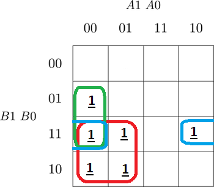
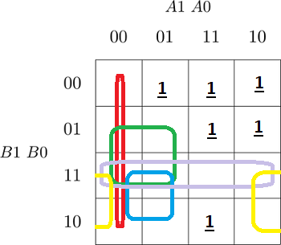
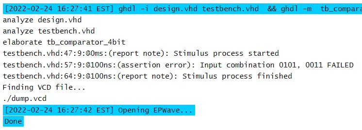
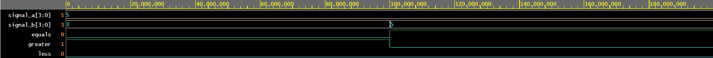
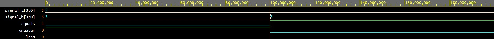

# Lab 2: David Hamran

## Preparation:

| **Dec. equivalent** | **B[1:0]** | **A[1:0]** | **B is greater than A** | **B equals A** | **B is less than A** |
  | :-: | :-: | :-: | :-: | :-: | :-: |
  |  0 | 0 0 | 0 0 | 0 | 1 | 0 |
  |  1 | 0 0 | 0 1 | 0 | 0 | 1 |
  |  2 | 0 0 | 1 0 | 0 | 0 | 1 |
  |  3 | 0 0 | 1 1 | 0 | 0 | 1 |
  |  4 | 0 1 | 0 0 | 1 | 0 | 0 |
  |  5 | 0 1 | 0 1 | 0 | 1 | 0 |
  |  6 | 0 1 | 1 0 | 0 | 0 | 1 |
  |  7 | 0 1 | 1 1 | 0 | 0 | 1 |
  |  8 | 1 0 | 0 0 | 1 | 0 | 0 |
  |  9 | 1 0 | 0 1 | 1 | 0 | 0 |
  | 10 | 1 0 | 1 0 | 0 | 1 | 0 |
  | 11 | 1 0 | 1 1 | 0 | 0 | 1 |
  | 12 | 1 1 | 0 0 | 1 | 0 | 0 |
  | 13 | 1 1 | 0 1 | 1 | 0 | 0 |
  | 14 | 1 1 | 1 0 | 1 | 0 | 0 |
  | 15 | 1 1 | 1 1 | 0 | 1 | 0 |


### 2-bit comparator

1. Karnaugh maps for other two functions:

   Greater than:

   

   Less than:

   

2. Equations of simplified SoP (Sum of the Products) form of the "greater than" function and simplified PoS (Product of the Sums) form of the "less than" function.

   

### 4-bit comparator

1. Listing of VHDL stimulus process from testbench file (`testbench.vhd`) with at least one assert (use BCD codes of your student ID digits as input combinations). Always use syntax highlighting, meaningful comments, and follow VHDL guidelines:

   Last two digits of my student ID: 53

```vhdl
          p_stimulus : process
          begin    

              report "Stimulus process started" severity note;

              --Will report error but comparator works
          signal_A <= "0101";
              signal_B <= "0011";
              wait for 100 ns;

              assert ((signal_A_greater_B = '0') and
                      (signal_A_equal_B  = '1') and
                      (signal_A_less_B    = '0'))

              report "Input combination 0101, 0011 FAILED" severity error;

              --Will not report error
          signal_A <= "0101";
              signal_B <= "0101";
              wait for 100 ns;

              assert ((signal_A_greater_B = '0') and
                      (signal_A_equal_B  = '1') and
                      (signal_A_less_B    = '0'))

              report "Input combination 0101, 0101 FAILED" severity error;


              report "Stimulus process finished" severity note;


              wait;

          end process p_stimulus;
```

2. Text console screenshot during your simulation, including reports.

   
   
    

3. Link to your public EDA Playground example:

   [4-bit comparator](https://www.edaplayground.com/x/h9Yk)
